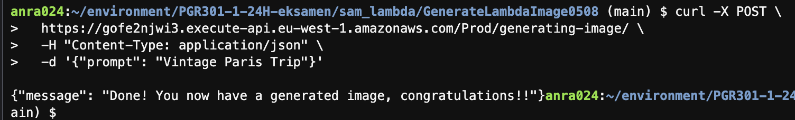
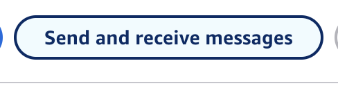

# Couch Explorers: Eksamensbesvarelse 2024

## Oppgave 1 - AWS Lambda
##  A. Oppgave: Implementer en Lambda-funksjon med SAM og API Gateway
    
### Kort om hva oppgaven gjør
Her har jeg oppdatert Lambda-funksjonen ved hjelp av AWS SAM og API Gateway for å generere et bilde. Prosessen fungerer slik at en prompt sendes via en POST-forespørsel, som Lambda-funksjonen mottar og behandler. Det genererte bildet lagres i S3-bucketen pgr301-couch-explorers, under objektet 41. Inne i mappen 41/generated_images/ finner man de genererte bildene.

### Leveransekrav
    |-------------------------------------------------------------------------------------------------------------------------|
    | Leveransekrav      | lenke                                                                                              |
    |-------------------------------------------------------------------------------------------------------------------------|
    | HTTP-endepunkt     | https://gofe2njwi3.execute-api.eu-west-1.amazonaws.com/Prod/generating-image/                      |
    |-------------------------------------------------------------------------------------------------------------------------|
    | Link til github-   | https://github.com/AnnaRandeberg/PGR301-1-24H-eksamen/actions/runs/11863054892/job/33063726910     |
    | actions workflow   |                                                                                                    |
    |-------------------------------------------------------------------------------------------------------------------------|
      
### Hvordan teste min leveranse

Bruk Postman eller curl for å sende en POST-forespørsel til Lambda-funksjonens HTTP-endepunkt.

HTTP-endepunkt:

    https://gofe2njwi3.execute-api.eu-west-1.amazonaws.com/Prod/generating-image/

Header:
Content-Type: application/json

Body (JSON):
Velg raw format hvis man bruker Postman.
Metode: POST

Eksempel på body:

Eks prompt:

        {
          "prompt": "Vintage Paris Trip"
        }

 ### Postman Test eksempel

Her er et skjermbilde av Postman-testen min:

### curl test
        
Terminalplassering
anra024:~/environment/PGR301-1-24H-eksamen/sam_lambda/GenerateLambdaImage0508

### kommando: 

        curl -X POST \
        https://gofe2njwi3.execute-api.eu-west-1.amazonaws.com/Prod/generating-image/ \
        -H "Content-Type: application/json" \
        -d '{"prompt": "Vintage Paris Trip"}'

   
   
   
### Verifisering i S3:
Naviger til S3-bucketen pgr301-couch-explorers og søk på 41.
Det genererte bilde finner man i /generated_images/    

### eks på generert bilde ved å bruke prompten "vintage paris trip" 

#### Timeout: har endret timeout til 40
#### IAM-rolle: IAM-rollen jeg brukte til denne oppgaven heter aws-role-lambda00111. Rollen ble opprettet før jeg startet oppgaven, og jeg la til nødvendige tillatelser i template.yaml under AttachPoliciesToExistingRole. Her inkluderte jeg både S3-tillatelser og Bedrock-tillatelser for å sikre at funksjonen kunne utføre sine oppgaver. 
#### Nødvendige tillatelser knyttet til rollen: s3:PutObject, s3:GetObject, s3:ListBucket. Disse er brukt for å laste opp og hente filer og liste objektene. Har også brukt bedrock:InvokeModel for å bruke bedrock til å generere bilder. Har også brukt AWSLambdaBasicExecutionRole for grunnelggende tillatelser for at aws funkjsonene skal kjøre, og gir meg logg data. 
#### Regionkonfigurasjon: Har brukt eu-west-1. 

## 1B: Opprett en GitHub Actions Workflow for SAM-deploy 

### Kort om hva oppgaven gjør
Jeg opprettet en github actions workflow som heter deploy_lambda.yml for å automatisere prossessen med å bygge og deploye Lambda-funksjonen GenerateLambdaImage0508 til AWS. 
- Den bygger funksjonen ved hjelp av sam build.
- Deployer ved hjelp av sam deploy, og laster opp koden til s3 bucketen pgr301-couch-explorers. 
- Den bruker aws secrets for å få tilgang til AWS

eks. på hvordan aws access keysene mine er lagt til i github repoet mitt

### Link til github-actions workflow:
    
        https://github.com/AnnaRandeberg/PGR301-1-24H-eksamen/actions/runs/11863054892/job/33063726910 
   
   
   
## Oppgave 2 - Infrastruktur med Terraform og SQS
## A. Infrastruktur som kode

### Kort om hva oppgaven gjør
I denne oppgaven har jeg implementert en løsning ved hjelp av Terraform som integrerer AWS SQS og Lambda for å generere bilder. Lambda-funksjonen mottar meldinger fra SQS-køen, bruker innholdet i meldingene til å lage bilder, og lagrer de genererte bildene i S3-bucketen pgr301-couch-explorers under stien /41/images/
        
Løsningen min er skalerbar fordi SQS-køen sørger for at meldinger blir håndtert i et kontrollert tempo, noe som forhindrer overbelastning av Lambda-funksjonen. Dette gjør den mer effektiv under høy belastning. 

IAM-policyen min inkluderer kun nødvendige tillatelser som kreves for å fullføre oppgaven. Et problem jeg møtte underveis var at jeg hadde glemt å inkludere tillatelser for Bedrock i policyen. Dette førte til at bildene mine ikke ble lastet opp som forventet. Jeg oppdaget feilen ved å teste SQS-køen og analysere feilmeldinger, som informerte meg om manglende Bedrock-tillatelse. Etter å ha lagt til de nødvendige tillatelsene, fungerte løsningen som den skulle.

### Leveransekrav
    |---------------------------------------------------------------------------------------------------------------------------------------------------------------------|
    | Leveransekrav                                                 |  lenke                                                                                              |
    |---------------------------------------------------------------------------------------------------------------------------------------------------------------------|
    | Lenke til kjørt GitHub Actions workflow                       |  https://github.com/AnnaRandeberg/PGR301-1-24H-eksamen/actions/runs/11898369726/job/33154714988     |
    |---------------------------------------------------------------------------------------------------------------------------------------------------------------------|
    | Lenke til en fungerende GitHub Actions workflow (ikke main)   |  https://github.com/AnnaRandeberg/PGR301-1-24H-eksamen/actions/runs/11897912330                     |                                                       
    |---------------------------------------------------------------------------------------------------------------------------------------------------------------------|
    | SQS-Kø URL                                                    |  https://sqs.eu-west-1.amazonaws.com/244530008913/41-image-queue                                    |                    
    |---------------------------------------------------------------------------------------------------------------------------------------------------------------------|

### Hvordan teste min løsning: 

### Med AWS Management Console

naviger til sqs
søk på : 41-image-queue

trykk på knappen vist på bildet

### eks prompt: 

    {
        "prompt": "A cat with a hat"
    }

send en prompt bilde

Verifisering i S3:
Naviger til S3-bucketen pgr301-couch-explorers og søk på 41.
Det genererte bilde finner man i /images/  

### Detaljer om oppgaven
- Terraform filene mine er plassert i mappen infra.
- Terraform ble brukt for å lage SQS køen, legge til IAM, og sette opp lambda funksjonen med en tilkobling til SQS. 

## 2B. Opprett en GitHub Actions Workflow for Terraform

### Kort om hva oppgaven gjør
Lagde en github actions workflow som jeg kalte terraform_deploy.yml. Dette skal automatisere deploy prosessen av infrastrukturen. Den kjører terraform apply på main og terraform plan på andre brancher. Har brukt github secrets for å legge til aws access keysene. 

### Lenke til kjørt GitHub Actions workflow:  
        
        https://github.com/AnnaRandeberg/PGR301-1-24H-eksamen/actions/runs/11898369726/job/33154714988 

### Lenke til en fungerende GitHub Actions workflow (ikke main): 
    
        https://github.com/AnnaRandeberg/PGR301-1-24H-eksamen/actions/runs/11897912330 

### SQS-Kø URL:  
    
        https://sqs.eu-west-1.amazonaws.com/244530008913/41-image-queue  

### Branch protection rule
For å forhindre at feilaktige endringer blir lagt til i main branchen har jeg laget en branch protection rule. Dette er for å sikre at terraform og workflows fungerer slik de skal. 

