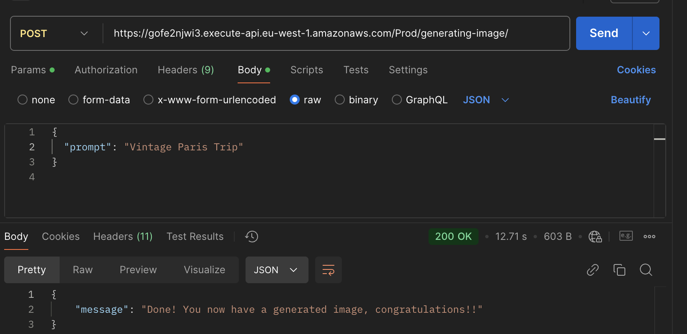
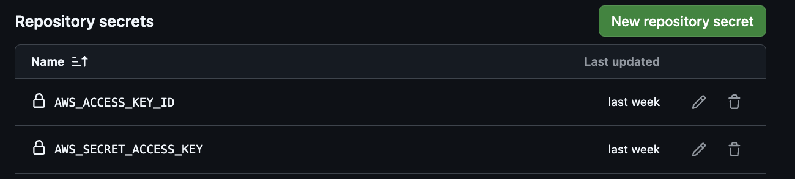
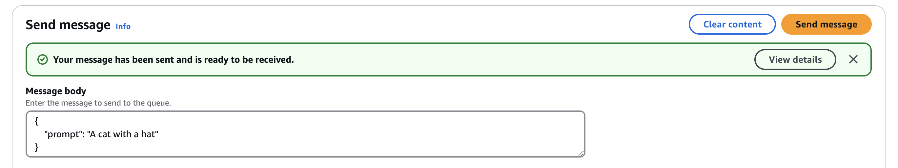
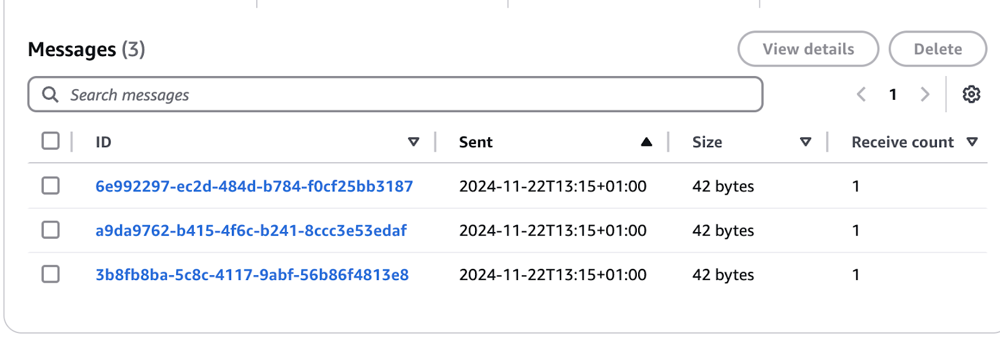
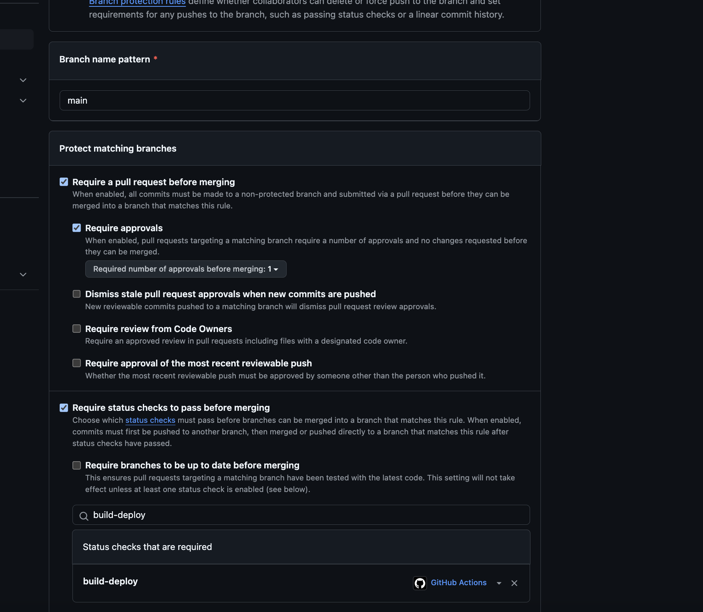
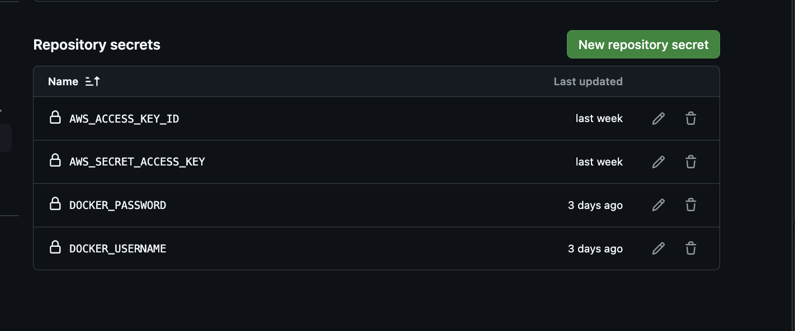
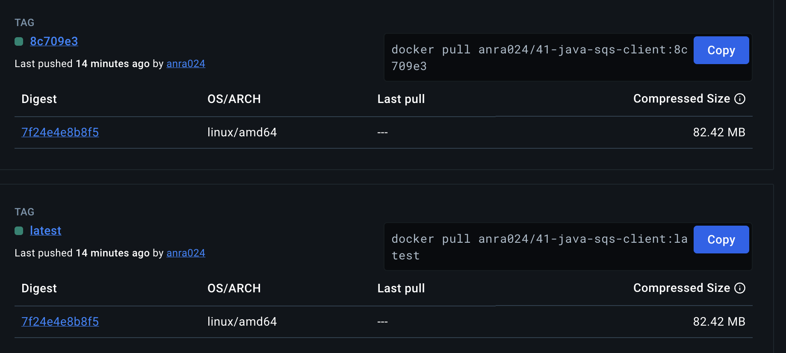
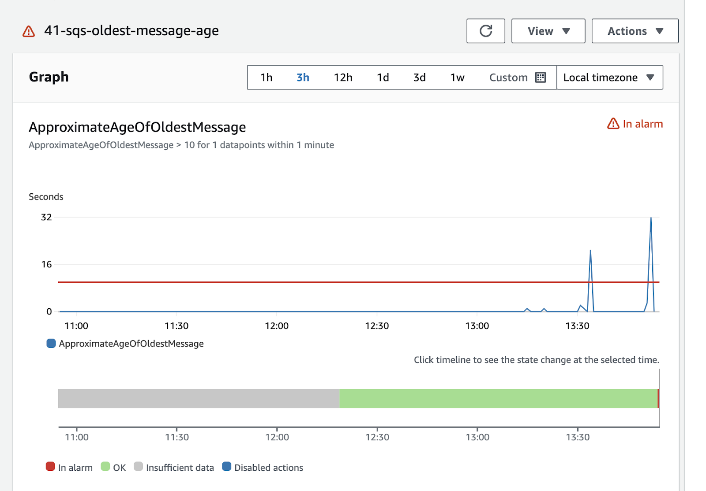
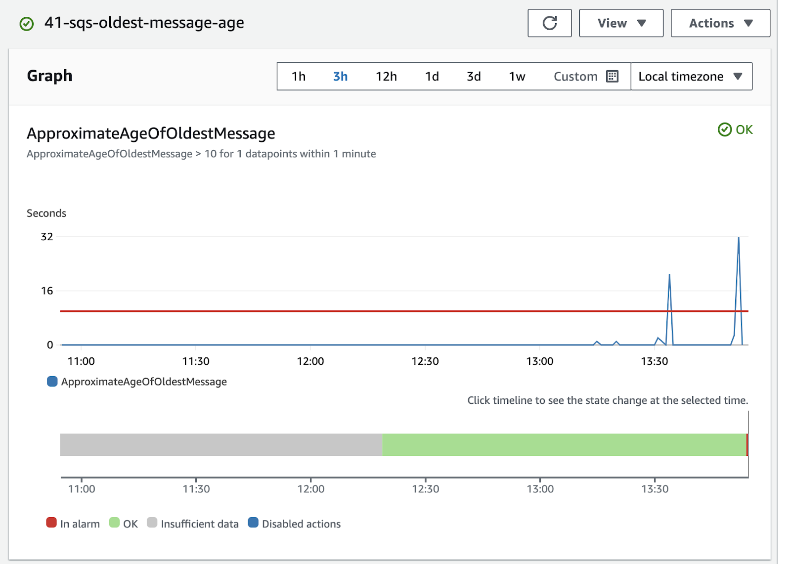

# Couch Explorers: Eksamensbesvarelse 2024

## Oppgave 1 - AWS Lambda
##  A. Oppgave: Implementer en Lambda-funksjon med SAM og API Gateway

## Leveransekrav:
### HTTP-endepunkt: 
    https://gofe2njwi3.execute-api.eu-west-1.amazonaws.com/Prod/generating-image/

Her er et skjermbilde av en Postman test jeg gjorde:

### Verifisering i S3:
Naviger til S3-bucketen pgr301-couch-explorers og søk på 41.
Det genererte bilde finner man i /generated_images/    

### Konfigurasjon og tilgangskontroll for AWS Lambda-funksjon
#### Timeout: har endret timeout til 40
#### IAM-rolle: IAM-rollen jeg brukte til denne oppgaven heter aws-role-lambda00111. Rollen ble opprettet før jeg startet oppgaven, og jeg la til nødvendige tillatelser i template.yaml under AttachPoliciesToExistingRole. Her inkluderte jeg både S3-tillatelser og Bedrock-tillatelser for å sikre at funksjonen kunne utføre sine oppgaver. 
#### Nødvendige tillatelser knyttet til rollen: s3:PutObject, s3:GetObject, s3:ListBucket. Disse er brukt for å laste opp og hente filer og liste objektene. Har også brukt bedrock:InvokeModel for å bruke bedrock til å generere bilder. Har også brukt AWSLambdaBasicExecutionRole for grunnelggende tillatelser for at aws funkjsonene skal kjøre, og gir meg logg data. 
#### Regionkonfigurasjon: Har brukt eu-west-1. 

## 1B: Opprett en GitHub Actions Workflow for SAM-deploy 

## Leveransekrav: 
### Lenke til github-actions workflow: 
    https://github.com/AnnaRandeberg/PGR301-1-24H-eksamen/actions/runs/12009869434/job/33475509473

Bilde av hvordan aws access keysene mine er lagt til i github repoet mitt

## Oppgave 2 - Infrastruktur med Terraform og SQS
## A. Infrastruktur som kode

### Hvorfor er løsnignen min skalerbar?        
Løsningen min er skalerbar fordi SQS-køen sørger for at meldinger blir håndtert i et kontrollert tempo, noe som forhindrer overbelastning av Lambda-funksjonen. Dette gjør den mer effektiv under høy belastning. 

### IAM policy
IAM-policyen min inkluderer kun nødvendige tillatelser som kreves for å fullføre oppgaven. Et problem jeg møtte underveis var at jeg hadde glemt å inkludere tillatelser for Bedrock i policyen. Dette førte til at bildene mine ikke ble lastet opp som forventet. Jeg oppdaget feilen ved å teste SQS-køen og analysere feilmeldinger, som informerte meg om manglende Bedrock-tillatelse. Etter å ha lagt til de nødvendige tillatelsene, fungerte løsningen som den skulle.

### image queue navn: 
    41-image-queue

send en prompt bilde

Bilder som ligger i sqs køen min

Verifisering i S3:
Naviger til S3-bucketen pgr301-couch-explorers og søk på 41.
Det genererte bilde finner man i /images/  

## 2B. Opprett en GitHub Actions Workflow for Terraform
## Leveransekrav
### Lenke til kjørt GitHub Actions workflow (main) som kun kjører terraform apply:  
        
        https://github.com/AnnaRandeberg/PGR301-1-24H-eksamen/actions/runs/11898369726

### Lenke til en fungerende GitHub Actions workflow (ikke main) som kun kjører terraform plan: 
    
        https://github.com/AnnaRandeberg/PGR301-1-24H-eksamen/actions/runs/11897912330

### SQS-Kø URL:  
    
        https://sqs.eu-west-1.amazonaws.com/244530008913/41-image-queue

Lagde en github actions workflow som jeg kalte terraform_deploy.yml. Dette skal automatisere deploy prosessen av infrastrukturen. Den kjører terraform apply på main og terraform plan på andre brancher. Har brukt github secrets for å legge til aws access keysene.   
        

### Branch protection rule
For å forhindre at feilaktige endringer blir lagt til i main branchen har jeg laget en branch protection rule. 

## Oppgave 3. Javaklient og Docker
### A. Skriv en Dockerfile
Dockerfilen finner man i java_sqs_client, har brukt multi stage dockerfile. 

Verifisering i S3:
Naviger til S3-bucketen pgr301-couch-explorers og søk på 41.
Det genererte bilde finner man i /images/  

### B. Lag en GitHub Actions workflow som publiserer container image til Docker Hub
### Dockerhub Actions som funker: 
https://github.com/AnnaRandeberg/PGR301-1-24H-eksamen/actions/runs/11974517991/job/33385767659

Bildet nedenfor viser at jeg har lagt til brukernavnet og token mitt i github secrets. Jeg brukte token i docker for å autentisere meg. 

## Leveransekrav:
### Beskrivelse av taggestrategi: 
Jeg har valgt å bruke både en latest-tag og en commit-hash tag. Ved å bruke latest er det lett å finne det nyeste imaget hvis man skal teste og da slipper man å tenke på en unik identifikator, men samtidig syns jeg det var viktig å kunne spore imagene igjen så derfor tenkte jeg det var lurt å legge til commit hash også. Hvis man f.eks vil debugge eller gå tilbake til en tidligere vrrsjon så er det lurt å ha med en commit hash som gjør det lett å spore. 

Her er et bilde av hvordan det ser ut i dockerhuben min med både en commit hash tag og en latest tag:

### Container image: 
    anra024/41-java-sqs-client
### sqs url: 
    https://sqs.eu-west-1.amazonaws.com/244530008913/41-image-queue
    

## Oppgave 4: Metrics og overvåkning

Alarmen min er konfigurert til å utløses hvis alderen på den eldste meldingen i køen overstiger terskelen min som er satt til 10 sekunder. 

Her ser man et eksempel av når jeg overfylte køen og alarmen min gikk: 

Når alle meldingene har blitt håndtert, så går den tilbake til ok igjen. 

## Oppgave 5. Serverless, Function as a service vs Container-teknologi

Valget av arkitektur er viktig for hvordan applikasjonen bygges, skaleres og vedlikeholdes. Vi kan velge mellom blant annet mikrotjenestearkitektur og serverless-arkitektur med function-as-a-service. Disse to har mange forskjeller, og valget avhenger av behovene til prosjektet. I denne drøftingen vil jeg se på hva som skiller dem, vurdere fordeler og ulemper, og diskutere hvordan valget påvirker ulike aspekter. Til slutt vil jeg oppsummere med en avsluttende drøfting etter å ha gjennomgått forskjellene.

### 1. 
Automatisering og CI/CD-pipelines påvirkes ulikt av serverless- og mikrotjenestearkitektur, og begge tilnærmingene har sine fordeler og ulemper. Dette skal vi se nærmere på.

Med en serverless-arkitektur kan man utvikle og kjøre kode uten å måtte sette opp infrastrukturen.Dette sparer utviklere for mye tid. Applikasjonen kjører og leverer fortsatt tjenester, men infrastrukturen håndteres av skyleverandører, som for eksempel AWS, som vi har brukt i vår oppgave. Eksempler på serverless-arkitektur inkluderer AWS Lambda og Amazon SQS.

I serverless-arkitektur, som vi har brukt i prosjektet vårt, behandles hver funksjon som en selvstendig enhet med sin egen livssyklus, versjonskontroll og utrulling. Ved bruk av CI blir koden skrevet og versjonskontrollert med for eksempel GitHub. Når koden pushes, starter CI-prosessen automatisk ved hjelp av GitHub Actions. Her testes koden for feil, og hvis testen er vellykket, bygges og pakkes koden. Terraform kan brukes til å lage regler for infrastrukturen som ønskes. Automatiseringen eliminerer manuelle prosesser, og funksjoner deployes automatisk. Gjennom CI/CD-pipelines distribueres funksjonene, for eksempel til AWS Lambda. Fordi funksjonene er små, går utrulling og testing raskere, noe som er en stor fordel. Samtidig må hver funksjon testes separat, noe som kan bli tidkrevende i større applikasjoner. Det kan også være utfordrende å holde oversikt over mange små funksjoner i store prosjekter. For mindre prosjekter fungerer dette godt, da det er lettere å ha kontroll. Siden infrastrukturen i serverless håndteres av en skyleverandør, kan automatiseringen være enklere. For eksempel blir koden deployet til AWS Lambda automatisk etter at den er pushet til GitHub via GitHub Actions, noe som er svært effektivt.

En mikrotjenestearkitektur består derimot av mange uavhengige tjenester. Disse komponentene samarbeider godt, men fordi de er klart avgrenset, blir ansvarsområdene tydelige. Dette er en fordel, da feil i én tjeneste ikke nødvendigvis påvirker hele systemet.

I en mikrotjenestearkitektur må infrastrukturen bygges fra bunnen av. Siden hver tjeneste er uavhengig, kan det bli utfordrende å holde oversikt over alle tjenestene etter hvert som systemet vokser. For å håndtere dette brukes ofte verktøy som Kubernetes og Docker.

CI-prosessen i en mikrotjenestearkitektur er ganske lik som i serverless. Koden lagres i for eksempel GitHub, og når den pushes, bygges og testes den ved hjelp av GitHub Actions. En forskjell er at mikrotjenester ofte benytter containere. For eksempel bygges Docker-bilder som lagres i Docker Hub. Containere gir bedre kontroll over applikasjonen og gjør det enklere å implementere CI/CD-pipelines. CI/CD sørger for automatisering av bygging, testing og utrulling av mikrotjenester, noe som gir effektivitet og reduserer risikoen for feil. Terraform kan også brukes til å sette opp infrastrukturen, noe som er nyttig fordi mikrotjenester ofte er mer komplekse. Automatisering gjør det mulig å håndtere mange tjenester effektivt, noe som sparer tid.

### 2. 
Observability (overvåkning) endres betydelig når man går fra mikrotjenester til serverless-arkitektur, med utfordringer som logging og feilsøking i FaaS-arkitekturen. Dette skal vi se nærmere på.

I en serverless-arkitektur håndteres infrastrukturen av skyleverandøren, som også tilbyr innebygde verktøy for overvåkning og logging. Et eksempel er AWS CloudWatch, som gir logger, alarmer og metrikker for hver funksjon. Dette gjør overvåkningen enklere, siden det blir lettere å oppdage feil. En ulempe med dette er imidlertid at overvåkningen kan bli mer fragmentert. Hver funksjon har sin egen livssyklus, og overvåkningen skjer derfor på funksjonsnivå. Dette kan gjøre det utfordrende å få en helhetlig oversikt over systemet. For eksempel kan det bli vanskelig for et team som jobber med ulike deler av systemet å sette sammen informasjonen fra de ulike loggene for å forstå helheten. Dette ble spesielt vist i forelesningen om alarmer og CloudWatch.

Som nevnt i forelesning 3 er cold starts en vanlig utfordring i serverless-arkitektur. Cold starts oppstår når en funksjon startes opp og det oppstår forsinkelser, noe som kan påvirke systemets ytelse negativt. 

Mikrotjenester har færre komponenter sammenlignet med serverless-arkitektur, noe som gjør det enklere å få oversikt over applikasjonen og styre de ulike tjenestene. Samtidig er komponentene i en mikrotjeneste ofte større og mer komplekse, noe som kan skape utfordringer. Derfor brukes verktøy som Docker og Kubernetes for å gjøre det enklere å håndtere. Docker og Kubernetes gir utviklerne bedre kontroll over infrastrukturen og øker fleksibiliteten. Utviklerne kan selv bestemme hva de ønsker å overvåke og logge, siden de har bygget infrastrukturen fra bunnen av. Dette er en fordel sammenlignet med serverless-arkitektur, hvor overvåkningen er forhåndsdefinert av skyleverandøren. Selv om man kan velge hva man vil logge i serverless, er mulighetene mer begrenset.

Når det gjelder feilsøking, er dette vanligvis enklere i mikrotjenester. Systemet er mindre oppdelt enn i serverless-arkitektur. I serverless kan det være vanskelig å spore feil tilbake til kilden på grunn av den høye graden av oppdeling. Mikrotjenester har færre, men større tjenester, noe som gjør det lettere å identifisere og rette feil.

### 3. 
Skalerbarhet og kostnadskontroll har ulike fordeler og ulemper i serverless- og mikrotjenestearkitektur, spesielt når det gjelder ressursytelse og kostnadsoptimalisering.

Som vist i forelesning 3, betaler man i en serverless-arkitektur kun for datakraften som faktisk brukes, noe som gjør dette til en svært kostnadseffektiv løsning. Dette er en av de største fordelene ved denne tilnærmingen. Samtidig kan kostnadene eskalere dersom applikasjonen har stor trafikkmengde. I tillegg kan feil, som en uoppdaget løkke som kjører kontinuerlig, føre til uforutsette kostnader. En annen betydelig fordel med serverless-arkitektur er at mange forespørsler kan håndteres samtidig, med automatisk skalering som reduserer behovet for manuell intervensjon. Dette fjerner også behovet for å administrere servere selv, ettersom slike oppgaver håndteres av skyplattformen, noe som reduserer stress ved økt belastning.

En ulempe med serverless er at minneplassen er begrenset, og det er kun midlertidig diskplass tilgjengelig. Likevel er det positivt at ingen kapasitet går til spille. For mindre prosjekter med begrenset budsjett kan serverless være et godt valg, mens større prosjekter med høy trafikk kan ha behov for mikrotjenester.

Som vi lærte i forelesning 5, kan mikrotjenester håndtere krevende oppgaver effektivt ved hjelp av containere. Samtidig innebærer mikrotjenester faste infrastrukturkostnader, uavhengig av trafikkmengden. Dette kan ha både fordeler og ulemper. For mindre prosjekter kan de faste kostnadene bli uforholdsmessig høye, noe som gjør mikrotjenester mindre kostnadseffektive. Valget mellom serverless og mikrotjenester avhenger derfor av hva man planlegger å utvikle, budsjettet som er tilgjengelig, og hvorvidt man ønsker å sette opp infrastrukturen selv.

Mikrotjenester krever ofte manuell skalering, for eksempel ved bruk av Kubernetes eller Docker. Dette kan være tidkrevende og krever forarbeid, men gir mer kontroll over infrastrukturen. En annen fordel med mikrotjenester er fleksibiliteten til å tilpasse minne og ressurser etter behov. Hvis en tjeneste trenger mer minne, kan dette justeres uten å påvirke andre tjenester. Dette gir stor fleksibilitet, men krever nøye oppfølging for å sikre optimal ytelse, noe som kan være krevende.

### 4. 
Eierskap og ansvar påvirkes ulikt i serverless- og mikrotjenestearkitektur, spesielt når det gjelder applikasjonens ytelse, pålitelighet og kostnader. Begge tilnærmingene har sine styrker og svakheter.

I en serverless-arkitektur slipper man å sette opp infrastrukturen selv, noe som er en stor fordel. Ansvar for infrastrukturen ligger hos skytjenesteleverandøren, noe som sparer utviklere for mye tid. Dette lar dem fokusere mer på funksjonalitet. Likevel må utviklere overvåke kostnadene nøye. Selv om man kun betaler for det som faktisk brukes, noe som er både praktisk og kostnadseffektivt, kan uforutsette feil, som en endeløs løkke, føre til høye kostnader.

En utfordring med serverless er at overvåkning og feilsøking ofte blir fragmentert, siden systemet består av mange små komponenter. Dette kan gjøre det vanskelig å administrere helheten og krever tett samarbeid for å sikre at systemet fungerer som en enhet.

I mikrotjenestearkitektur har teamet bedre kontroll over systemets livssyklus fordi de setter opp infrastrukturen selv. Dette gir dem eierskap og gjør det enklere å delegere oppgaver og ansvar, takket være tydelige skiller mellom tjenestene. Dette kan effektivisere arbeidet og gi større forutsigbarhet. Samtidig kan sterke avhengigheter mellom tjenestene gjøre det utfordrende å sikre sømløs samhandling og ansvarshåndtering. Teamet har også fullt ansvar for sin egen kode, noe som kan bidra til læring og forbedring over tid.

Siden infrastrukturen i serverless håndteres av leverandøren, er påliteligheten høy. Samtidig kan det være vanskelig å finne feil og overvåke systemet fordi leverandøren styrer mye av driften. Mikrotjenester, på den annen side, gir bedre kontroll gjennom klare skiller mellom tjenestene, noe som gjør feilsøking enklere. Dette krever imidlertid mer innsats både i oppstarten og gjennom prosjektets levetid.

### En samlet drøfting
Når man går fra en mikrotjenestearkitektur til en serverless-arkitektur, endres mye, som eierskap, ansvar, skalerbarhet, kostnader, overvåkning og automatisering. Serverless har den klare fordelen at man slipper å sette opp infrastrukturen selv, noe som sparer tid og innsats. Kostnadene er også fleksible, da man kun betaler for faktisk bruk, men dette kan bli dyrt ved feil som for eksempel en endeløs løkke. Overvåkning og feilsøking er mer utfordrende i serverless fordi hver funksjon har sin egen livssyklus og må testes separat. Dessuten er logge- og overvåkningsverktøyene forhåndsdefinert av skytjenesteleverandøren, noe som gir mindre frihet sammenlignet med mikrotjenester.

I en mikrotjenestearkitektur har man eierskap til infrastrukturen, som gir større kontroll og fleksibilitet. Her kan man selv velge hvordan overvåkningen og loggføringen skal settes opp, noe som gjør det lettere å tilpasse systemet til spesifikke behov. Kostnadene er faste, noe som krever nøye vurdering av budsjettet. Mikrotjenester passer derfor bedre for større prosjekter, mens serverless egner seg godt for mindre prosjekter med usikker trafikkmengde.

Valget mellom serverless og mikrotjenester avhenger av prosjektets størrelse, kompleksitet, budsjett, teamets kompetanse, tid og ønsket grad av kontroll.

